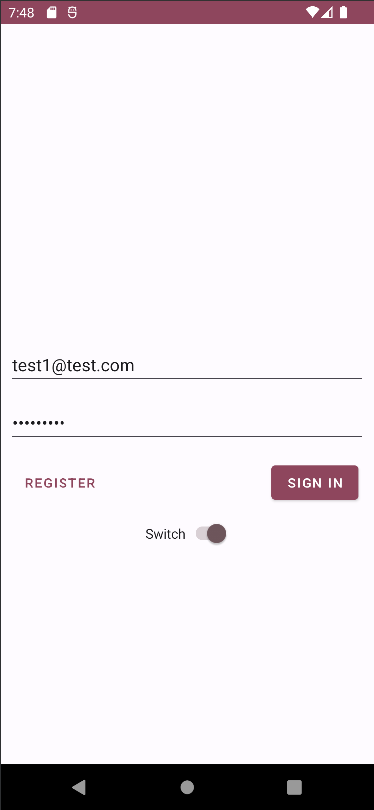
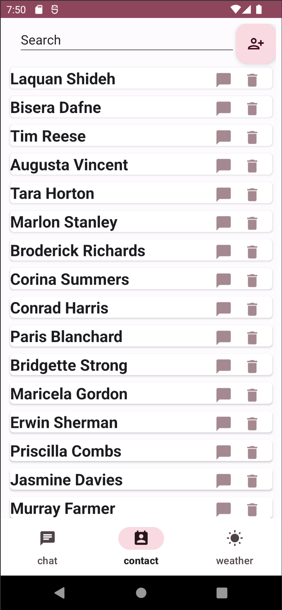
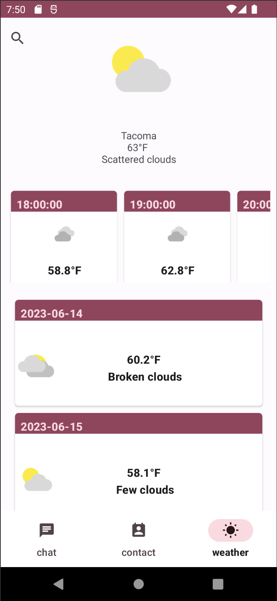

# Chat Application
This an android mobile chat app with weather forcast. 

# Technologies Used
+ Android
+ AndroidX
+ Jetpack Compose

# Libraries Used
+ RecyclerView: androidx.recyclerview:recyclerview
+ AppCompat: androidx.appcompat:appcompat
+ Material Design: com.google.android.material:material
+ ConstraintLayout: androidx.constraintlayout:constraintlayout
+ Volley: com.android.volley:volley
+ Google Maps: com.google.android.gms:play-services-maps
+ Navigation: androidx.navigation:navigation-fragment and androidx.navigation:navigation-ui
+ JUnit: junit:junit
+ Espresso: androidx.test.espresso:espresso-core
+ Data Binding: androidx.databinding:viewbinding
+ Pushy: me.pushy:sdk
+ JWT: com.auth0:java-jwt and com.auth0.android:jwtdecode

# Tools Used:
+ Android Studio: Used for developing the Android application.
+ Gradle: The build system used for managing dependencies and building the project.

# Feathres
+ Register a new account

+ Sign in to the application

+ View the chat room list

+ Remove a chat room from list or leave a chat room

+ View the messages from a chat room

+ Add member of remove member of a chat room

+ View the contact list

+ View hourly weather forcast of the curren location of the day, as well as the 7 days forcast

+ Select other location's weather forecast by city name or zipcode

+ Log out your account

# Contributing
+ Instructor: Charles Bryan
+ Registration: Majed Salahuddin
+ Chat List and Chat Room: Codi Chun
+ Contacts: Julia Kulev
+ Weather: JD Sawyer

# Contact
Email: codichun@outlook.com

# Additional Imformation
+ App Server: 
  - https://github.com/GreenUpBuddy/jds1223-tcss450-labs
  - https://github.com/CodiChun/ChatAppServer
